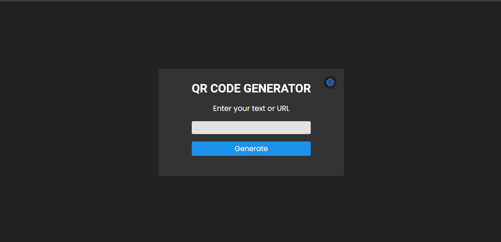

# Gerador de QR Code com API do Google

## 📌 Sobre

Projeto realizado para colocar em prática meu aprendizado em HTML, CSS e JavaScript, adaptei para o gosto do usuário, onde ele pode escolher entre o tema dark ou light, além é claro de gerar um QR Code com o texto ou URL informado por ele.
<br><br><strong>Obs:</strong> primeira vez utilizando API no JavaScript



## 📚 Aprendizado

<h3>HTML</h3>
<h3>CSS</h3>
<ul>
  <li>Flexbox</li>
  <li>Classes</li>
  <li>Cores e Tipografia</li>
  <li>Icones Externos</li>
</ul>
<h3>JavaScript</h3>
<ul>
  <li>Manipulaçao do DOM</li>
  
  ```js
  // Gerando o QR Code
  function generateQrCode() {
  const googleChartAPI =
    "https://chart.googleapis.com/chart?cht=qr&chs=400x400&chl=";
  const qrCodeContent = googleChartAPI + userInput.value;
  qrCode.src = qrCodeContent;
}
  ```
</ul>

## Link do site

### [Clique aqui](https://raphaelbaccega.github.io/qr-code-generator/)

---

Made with 💙 by Raphael Baccega 👋 [My LinkedIn](https://www.linkedin.com/in/raphael-couto-baccega/)
